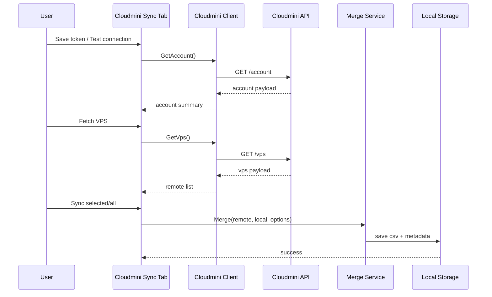

# Cloudmini API Integration Design

## Source reference

- External swagger: `https://client.cloudmini.net/static/swagger/cloudmini.json?v=1775123197850`
- Local snapshot used for design: `cloudmini.swagger.json`

## Base URL

`https://client.cloudmini.net/api/v2`

## Authentication

- Header name: `Authorization`
- Header format: `Token <token>`

## Endpoints used in Phase 2

## `GET /account`

Use:

- test token
- load account summary

Expected fields:

- `balance`
- `credit`

## `GET /vps`

Use:

- fetch all VPS
- fetch by id, ip, or order_id in future if needed

Expected fields from example:

- `pk`
- `ip`
- `user`
- `password`
- `created_at`
- `expired_at`
- `port`
- `cpu`
- `ram`
- `disk`
- `price`
- `location`
- `status`

## Optional future endpoints

## `GET /action`

Use:

- fetch available provider actions

Example action list:

- renew
- reboot
- start
- stop
- reset_password
- reinstall
- change_ip

## `POST /action`

Use:

- execute provider action for a VPS

Not in scope for Phase 2 sync-only implementation.

## Integration flow

## Merge algorithm

1. Load local `RdpEntry` list.
2. Load provider items from `GET /vps`.
3. For each provider item:
   - match by `SourceProvider + SourceId`
   - neu khong co, fallback match by `Host + Port + User`
4. Decide:
   - create
   - update
   - skip
   - conflict
5. Show preview summary.
6. Persist changes only after user confirm.

## Conflict scenarios

- Provider item co cung `Host + Port + User` voi local item nhung local item thuoc provider khac
- Provider item match fallback key nhung local da co custom HostName va custom password
- Provider item duplicate trong chinh payload

## Error handling policy

- 401/403: show `Token invalid or access denied`
- timeout/network error: allow retry
- malformed payload: write log and abort sync
- partial merge error: keep in-memory result, do not half-save blindly

## Token storage policy

- Token khong luu trong CSV
- Token khong log ra file plain text
- Neu user chon remember token, dung user-scoped encrypted storage

## Recommended implementation note

Vi project hien tai dang o `.NET Framework 4.0`, integration phase nen retarget len `.NET Framework 4.8.1` truoc khi them HTTP client va encrypted settings.

Ly do chon `.NET Framework 4.8.1` cho Phase 2:

- Duong nang cap ngan nhat tu codebase WPF hien tai
- Giam rui ro so voi viec migrate thang sang `.NET 8.0`
- Du cho nhu cau HTTPS API, settings ma hoa va maintainability o muc project nay
