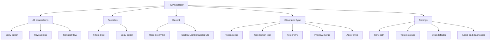

# Sitemap

## Navigation sitemap

## Navigation inventory

| Key | Type | Phase | Purpose |
| --- | --- | --- | --- |
| all-connections | List view | 1 | Hien toan bo entry |
| favorites | List view | 1 | Hien entry favorite |
| recent | List view | 1 | Hien entry moi connect |
| cloudmini-sync | Workflow view | 2 | Dong bo VPS tu Cloudmini |
| settings | Config view | 2 | Cau hinh app va token |

## Add/remove tab process

1. Them tab vao bang inventory.
2. Them 1 file spec moi trong `docs/ui`.
3. Cap nhat flowchart.
4. Them acceptance criteria cho tab.
5. Sau do moi them code UI.

## Sidebar order rule

Thu tu sidebar khuyen nghi:

1. All connections
2. Favorites
3. Recent
4. Cloudmini Sync
5. Settings

Ly do:

- 3 tab dau la daily use
- Cloudmini Sync la workflow theo dot
- Settings la utility
